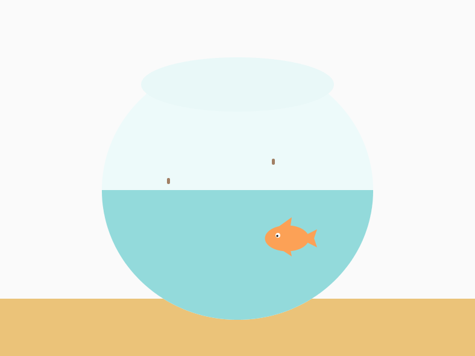
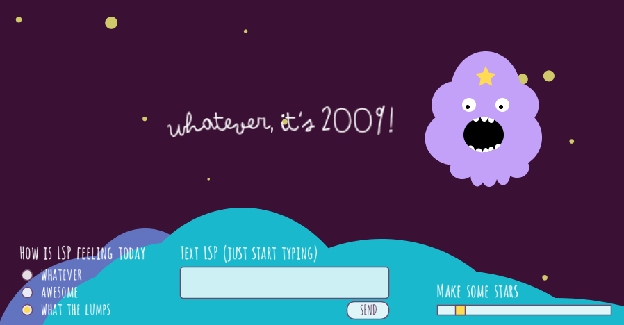
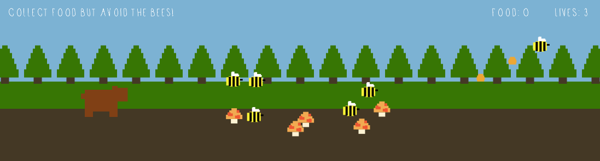
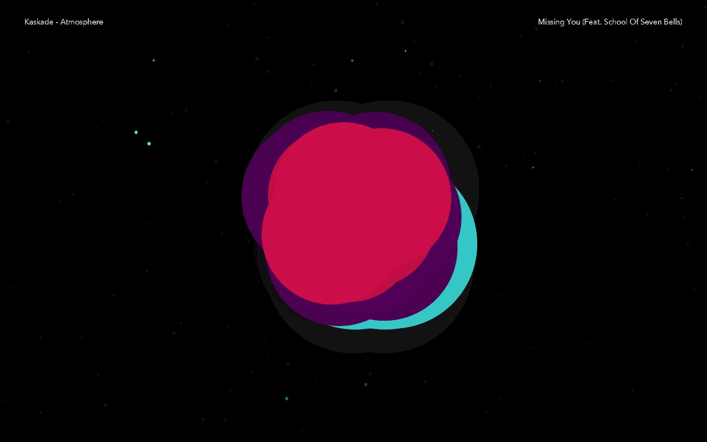

# Processing-Experiments
Experiments using various Processing libraries

> [Processing download and documentation](http://processing.org/)

## Fish Bowl 

 
Click inside the fish bowl to feed the fish

## Lumpy Space

 
Talk to LSP and change her mood in Lumpy Space

## Bear Game

 
Guide the bear through the forest, collect mushrooms and honey while avoiding the bees

## Audio Visualizer

 
Cosmic-inspired audio visualizer to Kaskade's album Atmosphere
